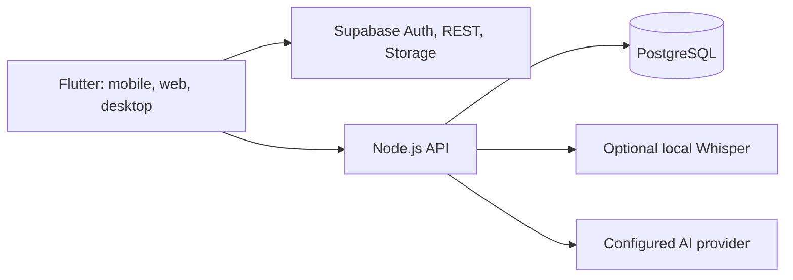

<div align="center">
  <picture>
    <source media="(prefers-color-scheme: dark)" srcset="assets/branding/lumenote_isotype_white.png" />
    <source media="(prefers-color-scheme: light)" srcset="assets/branding/lumenote_isotype_black.png" />
    
  </picture>
  <h1>Lumenote</h1>
  <p><strong>From recorded class to knowledge that sticks.</strong></p>
  <p>Capture once. Find the idea. Learn your way.</p>
  <p>
    <a href="https://lumenote-7ko.pages.dev"><strong>Visit Lumenote</strong></a> ·
    <a href="https://github.com/ToshioDev/lumenote-app">Source and project</a> ·
    <a href="https://github.com/ToshioDev/lumenote-app/issues">Share an idea</a> ·
    <a href="README.md">Español</a>
  </p>
  <p>
    <a href="https://flutter.dev"></a>
    <a href="https://dart.dev"></a>
    <a href="https://react.dev"></a>
    <a href="https://vite.dev"></a>
    <a href="https://www.typescriptlang.org"></a>
    <a href="https://nodejs.org"></a>
    <a href="https://www.postgresql.org"></a>
    <a href="https://supabase.com"></a>
    <a href="https://www.docker.com"></a>
    <a href="https://pages.cloudflare.com"></a>
  </p>
</div>

## Learn from every class—not just store its audio

Lumenote brings recordings, notes, and learning materials together by topic. Jump to an idea from its timestamp, understand the main points, and turn your notes into active study.

### Listen, then return to the exact moment

Record a class, follow its timestamped transcript, and find the important ideas without replaying the whole session.

<p align="center"></p>

### Connect every resource to its topic

Gather audio, documents, images, and links. Associate each resource with the moment it appears in class so its context stays with it.

<p align="center"></p>

### Study actively

Review with flashcards and multiple-choice questions based on your topics, then use progress feedback to spot what to practice again.

<p align="center"></p>

## What is in the project

- Flutter apps for Android, iOS, web, Windows, macOS, and Linux.
- Responsive offering site built with React, TypeScript, and Vite.
- Node.js backend, PostgreSQL, and optional local Whisper transcription services.
- Configurable Supabase integration for authentication, REST, and storage.
- Topic organization, timestamped transcripts, summaries, an AI tutor, and study tools. AI features depend on the provider and backend configuration.

## Run Lumenote on your own setup

You need Docker Compose v2 and your own Supabase project for Auth, PostgREST, and Storage; Supabase itself is not bundled with Compose.

```powershell
Copy-Item .env.example .env
Copy-Item backend/.env.example backend/.env
```

Configure your Supabase values, a strong PostgreSQL password, and any providers you choose to enable. Keep `.env` files private: service-role keys, AI tokens, and provider credentials belong on the backend only.

```powershell
docker compose up --build
```

Open the offering at `http://localhost:8080`, the app at `http://localhost:8765`, and the API at `http://localhost:8787`. Review and apply the migrations in [`supabase/migrations/`](supabase/migrations/) to your own project before using it. The local transcriber may take a few minutes to download its model on first launch.

### Offering development

```powershell
Set-Location offering
npm ci
npm run dev
```

Vite starts with hot reload at `http://localhost:5173`.

### Flutter app development

```powershell
flutter pub get
flutter run -d chrome `
  --dart-define=SUPABASE_URL=https://YOUR_PROJECT.supabase.co `
  --dart-define=SUPABASE_ANON_KEY=YOUR_PUBLISHABLE_KEY `
  --dart-define=LUMENOTE_AI_URL=http://localhost:8787
```

For remote deployments, `LUMENOTE_AI_URL` must be HTTPS and reachable from every device. A Supabase publishable key requires correctly configured RLS policies. See [deployment modes](docs/deployment-modes.md) for the components and hosting options.

## How it connects



## Build it with the community

Lumenote is under active development. Open an [issue](https://github.com/ToshioDev/lumenote-app/issues), suggest an improvement, or help with accessibility, Spanish transcription, mobile experience, and documentation. Run the relevant checks before contributing, such as `flutter analyze`, `flutter test`, `node --check backend/server.mjs`, and `python scripts/check_utf8.py`.

Memberships, billing, and the distribution console are not advertised as production-ready services yet. Their status is tracked in [`docs/membership-commerce-plan.md`](docs/membership-commerce-plan.md) and [`docs/distribution-control-plane.md`](docs/distribution-control-plane.md).

## License and asset rights

This repository does not yet include a `LICENSE` file. Public visibility by itself does not grant permission to reuse or redistribute the code. Kuromi branding and illustrations are third-party intellectual property and are not covered by a Lumenote license. Check asset rights before redistributing a build.

<p align="center"><sub>© 2026 Lumenote · Built so important ideas do not disappear when class ends.</sub></p>
