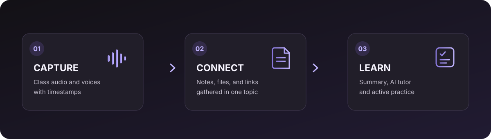
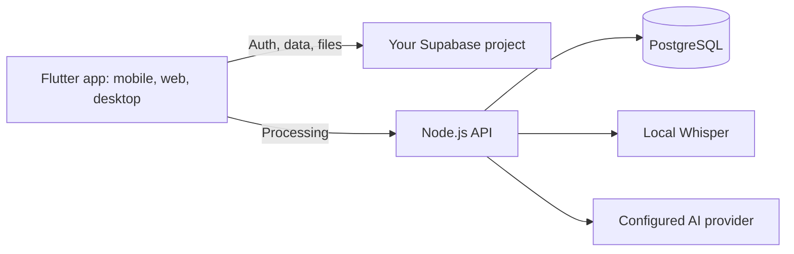

<div align="center">
  <picture>
    <source media="(prefers-color-scheme: dark)" srcset="assets/branding/lumenote_isotype_dark.png" />
    <source media="(prefers-color-scheme: light)" srcset="assets/branding/lumenote_isotype_light.png" />
    
  </picture>
  <h1>Lumenote</h1>
  <p><strong>Turn your classes into knowledge you can return to.</strong></p>
  <p>Record once. Keep the context. Learn from your own materials.</p>
  <p>
    <a href="https://lumenote-7ko.pages.dev"><strong>Explore Lumenote ↗</strong></a> ·
    <a href="#quick-start">Self-host the app</a> ·
    <a href="https://github.com/ToshioDev/lumenote-app/issues">Report or suggest</a> ·
    <a href="README.md">Español</a>
  </p>
</div>

<p align="center">
  
</p>

## Audio is just the beginning

Lumenote brings recordings, timestamped transcripts, notes, and resources together under one topic. Return to the moment that matters, make sense of a session, and turn its content into study practice.

- **Capture:** record and replay sessions; follow transcripts along the timeline.
- **Organize:** group notes, documents, images, and links by topic, including links to a specific moment.
- **Learn:** create summaries and use the AI tutor, flashcards, and questions to review. AI features require a provider configured on the backend.

## Quick start

You need Docker Compose v2 and your own Supabase project. Supabase is not included in this Compose setup: authentication and storage connect to your own instance.

**1. Create local configuration files.**

```bash
cp .env.example .env
cp backend/.env.example backend/.env
```

**2. Configure the variables.** Set `SUPABASE_URL`, `SUPABASE_ANON_KEY`, and a strong PostgreSQL password in the root `.env`. Configure `backend/.env` for the API and any providers you want to enable. Never publish `service_role` keys, AI tokens, or other secrets.

**3. Start the services.**

```bash
docker compose up --build
```

| Service | Local address |
| --- | --- |
| Web app | <http://localhost:8765> |
| API | <http://localhost:8787> |

Review and apply the migrations in [`supabase/migrations/`](supabase/migrations/) before using your instance. Whisper downloads its model on first launch, which can take a while. For remote deployments, `LUMENOTE_AI_URL` must point to an HTTPS URL reachable from the browser; internal Docker names are not reachable from users' devices. See [deployment modes](docs/deployment-modes.md) for dependencies and limitations.

## How the pieces connect



PostgreSQL stores API-specific data; Supabase is external and must be configured separately. Whisper runs locally as a Docker service. AI feature availability and cost depend on the provider you configure.

## Development and stack

To run Flutter in Chrome, install Flutter, run `flutter pub get`, and set the addresses for your Supabase project and backend:

```bash
flutter run -d chrome --dart-define=SUPABASE_URL=https://YOUR_PROJECT.supabase.co --dart-define=SUPABASE_ANON_KEY=YOUR_PUBLISHABLE_KEY --dart-define=LUMENOTE_AI_URL=http://localhost:8787
```

The Supabase publishable key needs correct RLS policies. Do not include private secrets in `--dart-define` or the client app.

<p>
  
  
  
  
  
  
</p>

## Project status

Lumenote is under active development. Before proposing a change, run the relevant checks: `flutter analyze`, `flutter test`, `node --check backend/server.mjs`, and `python scripts/check_utf8.py`. Share bugs and ideas in [GitHub Issues](https://github.com/ToshioDev/lumenote-app/issues).

Memberships, billing, and the distribution dashboard are not advertised as production-ready commercial services yet. Their status is documented in [`docs/membership-commerce-plan.md`](docs/membership-commerce-plan.md) and [`docs/distribution-control-plane.md`](docs/distribution-control-plane.md).

## License and assets

This repository does not yet include a `LICENSE` file; public visibility alone does not grant permission to reuse or redistribute the code. The Kuromi character and illustrations belong to their respective rights holders and are not covered by a Lumenote license. Check the rights for each asset before redistributing a build.

<p align="center"><sub>© 2026 Lumenote · Keep important ideas from disappearing when class ends.</sub></p>
