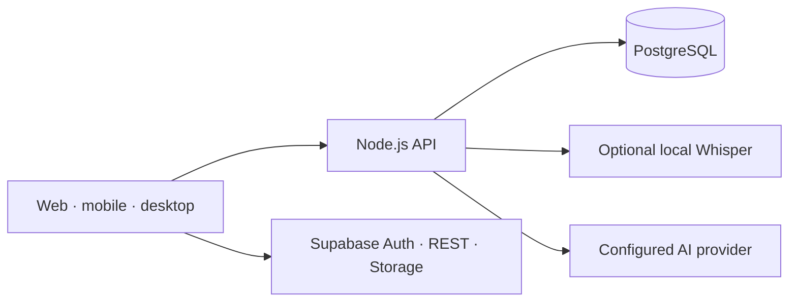

<div align="center">
  <picture>
    <source media="(prefers-color-scheme: dark)" srcset="assets/branding/lumenote_isotype_white.png" />
    <source media="(prefers-color-scheme: light)" srcset="assets/branding/lumenote_isotype_black.png" />
    
  </picture>
  <h1>Lumenote</h1>
  <p><strong>Turn a recorded class into something you can actually remember.</strong></p>
  <p>Capture what matters. Understand it better. Study your way.</p>
  <p>
    <a href="README.md">Español</a> ·
    <a href="https://github.com/ToshioDev/lumenote-app">Explore the project</a> ·
    <a href="https://github.com/ToshioDev/lumenote-app/issues">Share an idea</a>
  </p>
  <p>
    
    
    
    <a href="https://github.com/ToshioDev/lumenote-app/actions/workflows/utf8.yml"></a>
  </p>
</div>

<p align="center">
  
</p>

## Learning shouldn't disappear when class ends

Lumenote brings recordings, documents, images, and notes into one topic-based study space. Instead of replaying an hour to find one idea, jump back to the moment, read a focused summary, and practice what you learned.

**Capture once. Return to what matters whenever you need it.**

| Capture | Understand | Remember |
| --- | --- | --- |
| Keep audio, documents, images, links, and text together by topic. | Explore timestamped transcripts, summaries, and contextual chat. | Turn your notes into flashcards and quizzes that check understanding. |

## A workflow for learning, not just filing things away

- **Organize by topic:** bring classes and materials together under names that make sense to you.
- **Revisit the audio:** keep the recording and move through its transcript by timestamp.
- **Get useful notes:** surface key ideas and follow-ups while keeping their source context.
- **Ask about your material:** chat with content through the backend and provider you configure.
- **Practice actively:** study with flashcards and quizzes linked to your topics.
- **Make it yours:** use the app across platforms and personalize its appearance.

AI capabilities depend on deployment configuration. Local Whisper transcription can run in the Docker stack; external providers require your own credentials and are subject to their service terms.

## Run it on your own setup

The quickest way to start the web app, API, PostgreSQL, and local transcription service is Docker Compose. You will also need your own Supabase project for Auth, PostgREST, and Storage; Supabase itself is not bundled in Compose.

```powershell
Copy-Item .env.example .env
Copy-Item backend/.env.example backend/.env
```

Add your Supabase values and a strong, unique PostgreSQL password to `.env`. Configure `backend/.env` with the providers and credentials you choose. Keep both files private, and never put server secrets in the Flutter client.

```powershell
docker compose up --build
```

Open the app at `http://localhost:8765`; the API is at `http://localhost:8787`. Whisper may take a few minutes to download a model on first startup. Review and apply the migrations in [`supabase/migrations/`](supabase/migrations/) to your own project before using the app.

To run Flutter directly, install the Flutter SDK and provide your client configuration:

```powershell
flutter pub get
flutter run -d chrome `
  --dart-define=SUPABASE_URL=https://YOUR_PROJECT.supabase.co `
  --dart-define=SUPABASE_ANON_KEY=YOUR_PUBLISHABLE_KEY `
  --dart-define=LUMENOTE_AI_URL=http://localhost:8787
```

For remote deployments, `LUMENOTE_AI_URL` must be an HTTPS address reachable from the browser or device. A Supabase publishable key is safe only with correctly configured RLS policies. Service-role keys, Codex tokens, and provider credentials belong on the backend only.

## Architecture



The repository includes Flutter clients for Android, iOS, web, Windows, macOS, and Linux; a Node.js API; PostgreSQL for backend data; and an optional Whisper container. Supabase Auth, REST, and Storage are configured separately. See [deployment modes](docs/deployment-modes.md) before choosing where to host it.

## Let's make it better together

Lumenote is actively being developed. Try it with your own backend, tell us where the workflow gets in the way, propose a feature, or help improve accessibility, Spanish transcription, mobile UX, documentation, and deployment.

1. Open an [issue](https://github.com/ToshioDev/lumenote-app/issues) to discuss an idea or report a problem.
2. Explore the project and pick a small, testable improvement.
3. Run the relevant checks before sharing your changes:

```powershell
flutter analyze
flutter test
node --check backend/server.mjs
node --check backend/codex_runtime.mjs
python scripts/check_utf8.py
```

Memberships, checkout, payment webhooks, and the distribution console are still at different stages; they are not presented as production-ready services. Current status and limitations are documented in [`docs/membership-commerce-plan.md`](docs/membership-commerce-plan.md) and [`docs/distribution-control-plane.md`](docs/distribution-control-plane.md).

## Before reusing this project

This repository does not yet include a `LICENSE`; public visibility does not grant permission to reuse or redistribute the code. The Kuromi illustrations and branding are third-party intellectual property and are not licensed by this project either. If you want to reuse or redistribute Lumenote, wait for an explicit project license and verify the rights for each asset separately.

Contributions are welcome. A small improvement shared today can make someone's next class easier to remember.
