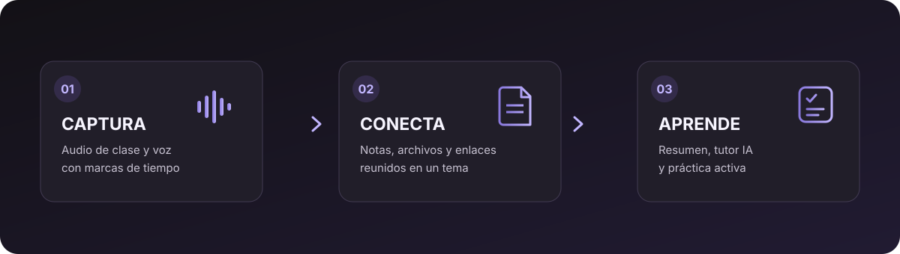
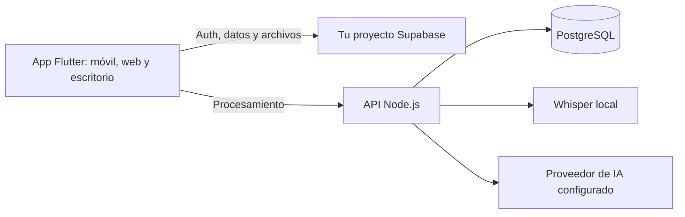

<div align="center">
  <picture>
    <source media="(prefers-color-scheme: dark)" srcset="assets/branding/lumenote_isotype_dark.png" />
    <source media="(prefers-color-scheme: light)" srcset="assets/branding/lumenote_isotype_light.png" />
    
  </picture>
  <h1>Lumenote</h1>
  <p><strong>Convierte tus clases en conocimiento que puedes recuperar.</strong></p>
  <p>Graba una vez. Conserva el contexto. Aprende con tus propios materiales.</p>
  <p>
    <a href="https://lumenote-7ko.pages.dev"><strong>Explorar Lumenote ↗</strong></a> ·
    <a href="#inicio-rapido">Desplegar por tu cuenta</a> ·
    <a href="https://github.com/ToshioDev/lumenote-app/issues">Reportar o proponer</a> ·
    <a href="README.en.md">English</a>
  </p>
</div>

<p align="center">
  
</p>

## El audio es el comienzo

Lumenote reúne grabaciones, transcripciones con marcas de tiempo, notas y recursos bajo un mismo tema. Así puedes volver al momento importante, entender la sesión y transformar su contenido en práctica de estudio.

- **Captura:** graba y reproduce sesiones; consulta la transcripción vinculada a su línea de tiempo.
- **Organiza:** agrupa notas, documentos, imágenes y enlaces por tema, incluso asociados a un momento concreto.
- **Aprende:** genera resúmenes y usa el tutor IA, tarjetas y preguntas para repasar. La IA requiere configurar un proveedor en el backend.

## Inicio rápido

Necesitas Docker Compose v2 y un proyecto Supabase propio. Supabase no forma parte de este Compose: la autenticación y el almacenamiento se conectan a tu instancia.

**1. Crea la configuración local.**

```bash
cp .env.example .env
cp backend/.env.example backend/.env
```

**2. Configura las variables.** En el `.env` raíz define `SUPABASE_URL`, `SUPABASE_ANON_KEY` y una contraseña PostgreSQL fuerte. Configura `backend/.env` para la API y los proveedores que quieras habilitar. Nunca publiques claves `service_role`, tokens de IA ni secretos.

**3. Inicia los servicios.**

```bash
docker compose up --build
```

| Servicio | Dirección local |
| --- | --- |
| App web | <http://localhost:8765> |
| API | <http://localhost:8787> |

Antes de usar la instancia, revisa y aplica las migraciones de [`supabase/migrations/`](supabase/migrations/). El primer inicio de Whisper descarga el modelo y puede tardar. Para despliegues remotos, `LUMENOTE_AI_URL` debe apuntar a una URL HTTPS accesible desde el navegador; los nombres internos de Docker no son accesibles desde los dispositivos de los usuarios. Consulta [modos de despliegue](docs/deployment-modes.md) para conocer los límites y dependencias.

## Cómo se conectan las piezas



PostgreSQL almacena los datos propios de la API; Supabase es externo y debes configurarlo por separado. Whisper se ejecuta localmente como servicio Docker. La disponibilidad y el coste de las funciones de IA dependen del proveedor que configures.

## Desarrollo y tecnologías

Para ejecutar Flutter en Chrome en desarrollo, instala Flutter, ejecuta `flutter pub get` y define las direcciones de tu Supabase y backend:

```bash
flutter run -d chrome --dart-define=SUPABASE_URL=https://TU_PROYECTO.supabase.co --dart-define=SUPABASE_ANON_KEY=TU_CLAVE_PUBLICABLE --dart-define=LUMENOTE_AI_URL=http://localhost:8787
```

La clave publicable de Supabase necesita políticas RLS correctas. No incluyas secretos privados en `--dart-define` ni en la app cliente.

<p>
  
  
  
  
  
  
</p>

## Estado del proyecto

Lumenote está en desarrollo. Antes de proponer cambios, ejecuta las comprobaciones que apliquen: `flutter analyze`, `flutter test`, `node --check backend/server.mjs` y `python scripts/check_utf8.py`. Reporta errores e ideas en [GitHub Issues](https://github.com/ToshioDev/lumenote-app/issues).

Las membresías, los cobros y el panel de distribución aún no se anuncian como servicios comerciales listos. Su estado está documentado en [`docs/membership-commerce-plan.md`](docs/membership-commerce-plan.md) y [`docs/distribution-control-plane.md`](docs/distribution-control-plane.md).

## Licencia y assets

Este repositorio aún no contiene un archivo `LICENSE`; que el código sea visible no concede por sí solo permiso para reutilizarlo o redistribuirlo. La marca y las ilustraciones de Kuromi pertenecen a sus respectivos titulares y no están cubiertas por una licencia de Lumenote. Revisa los derechos de cada asset antes de redistribuir una compilación.

<p align="center"><sub>© 2026 Lumenote · Que las ideas importantes no se pierdan al terminar la clase.</sub></p>
