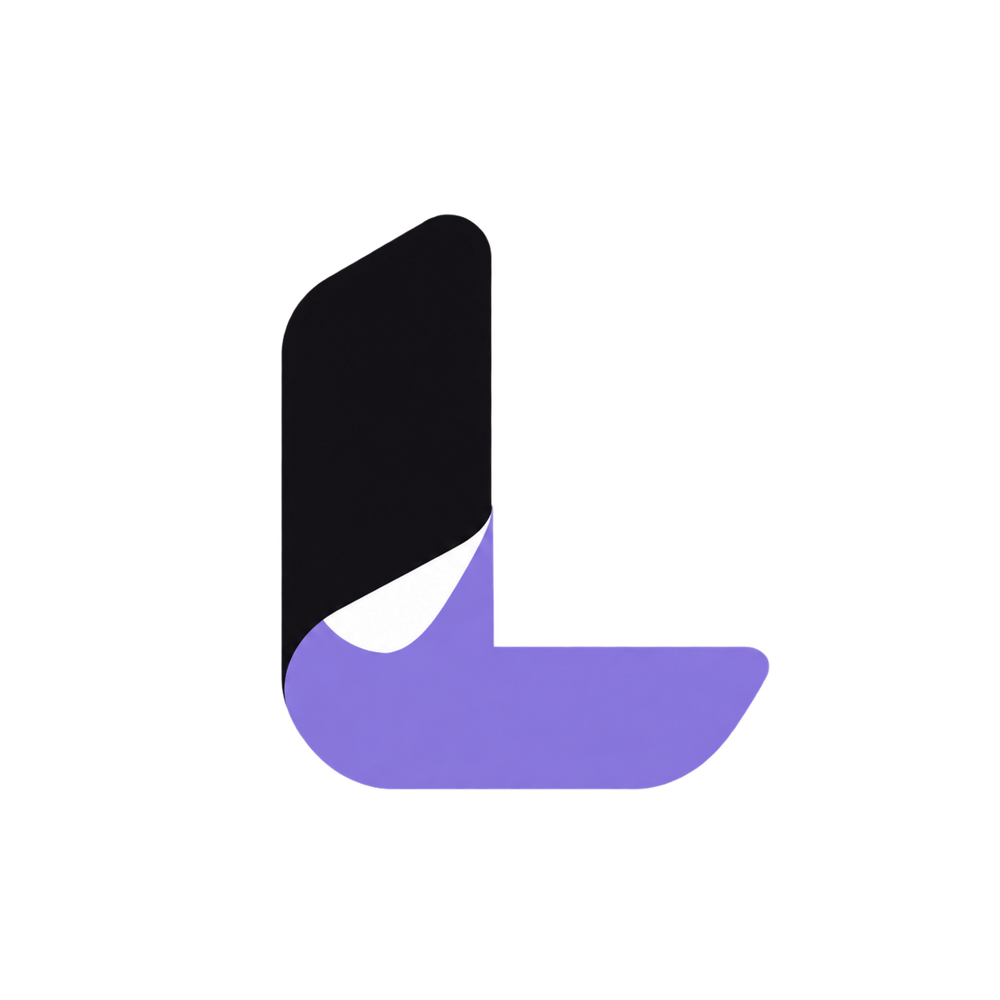
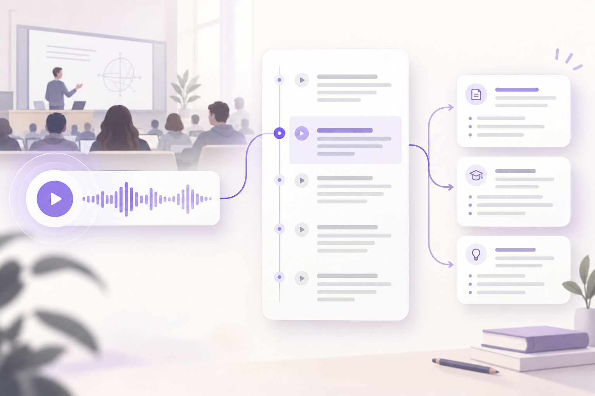
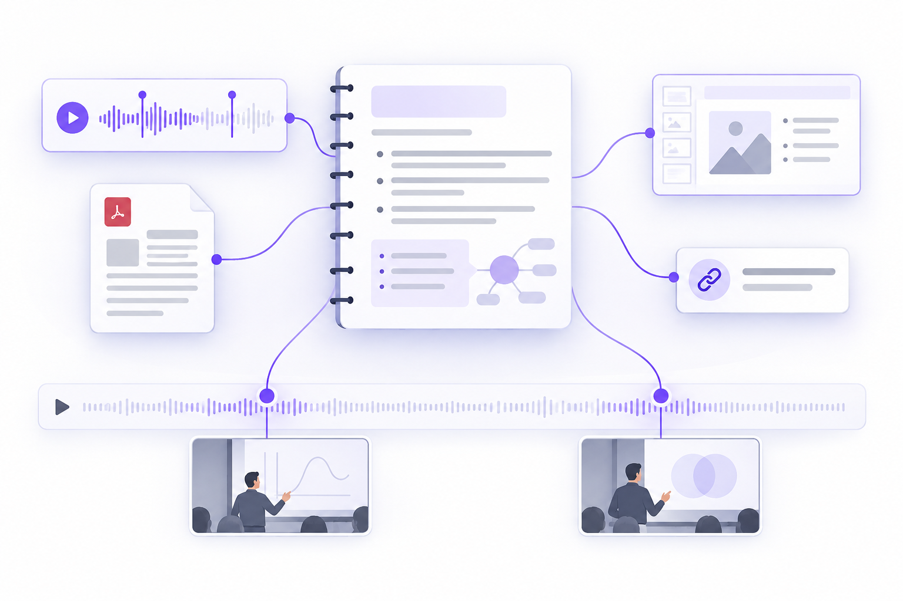
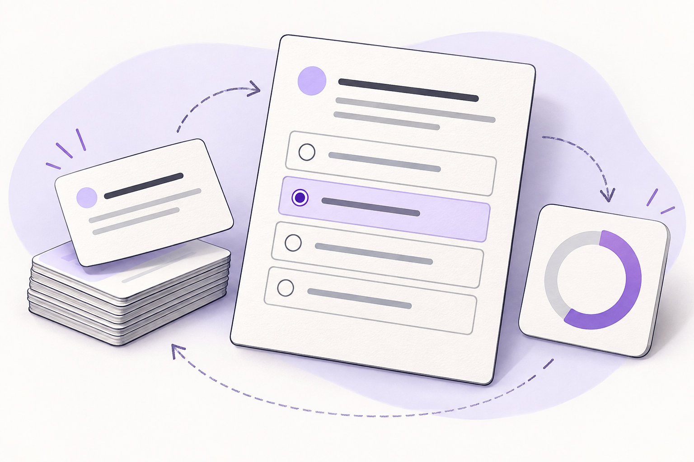

<div align="center">
  <picture>
    <source media="(prefers-color-scheme: dark)" srcset="assets/branding/lumenote_isotype_dark.png" />
    <source media="(prefers-color-scheme: light)" srcset="assets/branding/lumenote_isotype_light.png" />
    
  </picture>
  <h1>Lumenote</h1>
  <p><strong>De una clase grabada a ideas que permanecen.</strong></p>
  <p>Graba, conecta tus materiales y convierte cada tema en una oportunidad para aprender.</p>
  <p>
    <a href="https://lumenote-7ko.pages.dev"><strong>Conocer Lumenote</strong></a> ·
    <a href="https://github.com/ToshioDev/lumenote-app/issues">Proponer una mejora</a> ·
    <a href="README.en.md">English</a>
  </p>
  <p>
    
    
    
    
    
    
  </p>
</div>

## Del audio al aprendizaje

Una clase no termina cuando paras la grabación. Lumenote organiza la sesión y sus recursos alrededor del tema para que puedas volver a lo importante y practicarlo después.

<table>
  <tr>
    <td align="center" width="33%">
      
      <strong>01 · Captura</strong><br />Graba y vuelve a cada momento mediante marcas de tiempo.
    </td>
    <td align="center" width="33%">
      
      <strong>02 · Conecta</strong><br />Reúne notas, documentos, imágenes y enlaces en un tema.
    </td>
    <td align="center" width="33%">
      
      <strong>03 · Practica</strong><br />Repasa con tarjetas y preguntas basadas en tus materiales.
    </td>
  </tr>
</table>

<p align="center"><sub>Ilustraciones conceptuales del flujo; no son capturas de pantalla de la aplicación.</sub></p>

## Qué encontrarás en el proyecto

- **App multiplataforma con Flutter:** Android, iOS, web y escritorio.
- **API Node.js** y PostgreSQL para los datos y trabajos de procesamiento.
- **Transcripción local opcional con Whisper**, ejecutada como servicio separado y con caché persistente del modelo.
- **Supabase configurable** para autenticación, acceso a datos y almacenamiento; debes proporcionar tu propio proyecto Supabase.
- Organización por temas, grabación y reproducción, transcripciones con marcas de tiempo, resúmenes, tutor IA y herramientas de estudio. Las funciones de IA dependen de la configuración del backend y del proveedor habilitado.

## Levantar la versión web con Docker

Requisitos: Docker Compose v2 y un proyecto Supabase. Este Compose **no instala Supabase**: levanta la app web, la API, PostgreSQL para los datos de la API y el servicio local de Whisper.

Crea los archivos de configuración a partir de las plantillas:

```bash
cp .env.example .env
cp backend/.env.example backend/.env
```

Completa `SUPABASE_URL` y `SUPABASE_ANON_KEY` en el `.env` raíz y configura `backend/.env`. Usa una contraseña PostgreSQL fuerte. No pongas claves `service_role`, credenciales de IA ni secretos de proveedores en el `.env` raíz ni en la app cliente.

```bash
docker compose up --build
```

Al iniciar:

- App web: `http://localhost:8765`
- API: `http://localhost:8787`

Antes de usar tu instancia, revisa y aplica las migraciones de [`supabase/migrations/`](supabase/migrations/) y consulta la guía de [modos de despliegue](docs/deployment-modes.md). El primer arranque de Whisper puede tardar mientras descarga el modelo. Para una URL remota, configura `LUMENOTE_AI_URL` con una dirección HTTPS accesible desde el navegador del usuario; un nombre interno de Docker no será accesible desde el dispositivo.

### Ejecutar Flutter en desarrollo

Instala Flutter, ejecuta `flutter pub get` y configura los valores de Supabase y de la API para tu entorno:

```bash
flutter run -d chrome --dart-define=SUPABASE_URL=https://TU_PROYECTO.supabase.co --dart-define=SUPABASE_ANON_KEY=TU_CLAVE_PUBLICABLE --dart-define=LUMENOTE_AI_URL=http://localhost:8787
```

La clave publicable de Supabase requiere políticas RLS bien configuradas. Nunca incluyas claves privadas en `--dart-define` ni en un build cliente.

## Arquitectura


La autenticación y el almacenamiento Supabase son servicios externos configurados por quien despliega. PostgreSQL y Whisper del Compose son servicios privados de apoyo para la API; no constituyen una instalación completa de Supabase.

## Contribuir

El proyecto sigue en desarrollo. Puedes compartir errores o propuestas en [GitHub Issues](https://github.com/ToshioDev/lumenote-app/issues). Antes de enviar un cambio, ejecuta las verificaciones relevantes, por ejemplo `flutter analyze`, `flutter test`, `node --check backend/server.mjs` y `python scripts/check_utf8.py`.

Las membresías, los cobros y el panel de distribución no se presentan aquí como servicios comerciales listos. Consulta [`docs/membership-commerce-plan.md`](docs/membership-commerce-plan.md) y [`docs/distribution-control-plane.md`](docs/distribution-control-plane.md) para ver su estado.

## Licencia y assets

El repositorio no incluye actualmente un archivo `LICENSE`. Que el código sea visible públicamente no concede por sí solo permiso para reutilizarlo o redistribuirlo. La marca y las ilustraciones de Kuromi pertenecen a sus respectivos titulares y no están cubiertas por una licencia de Lumenote; revisa los derechos de cada asset antes de redistribuir una compilación.

<p align="center"><sub>© 2026 Lumenote · Guarda el contexto de la clase, no solo el archivo de audio.</sub></p>
