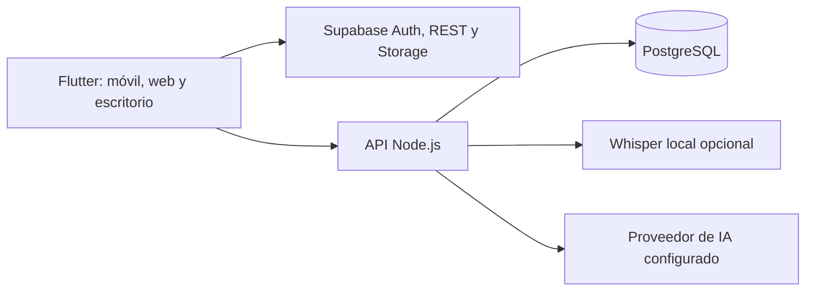

<div align="center">
  <picture>
    <source media="(prefers-color-scheme: dark)" srcset="assets/branding/lumenote_isotype_dark.png" />
    <source media="(prefers-color-scheme: light)" srcset="assets/branding/lumenote_isotype_light.png" />
    
  </picture>
  <h1>Lumenote</h1>
  <p><strong>De la clase grabada a lo que sí recuerdas.</strong></p>
  <p>Captura una vez. Encuentra la idea. Aprende a tu manera.</p>
  <p>
    <a href="https://lumenote-7ko.pages.dev"><strong>Visitar Lumenote</strong></a> ·
    <a href="https://github.com/ToshioDev/lumenote-app">Código y proyecto</a> ·
    <a href="https://github.com/ToshioDev/lumenote-app/issues">Compartir una idea</a> ·
    <a href="README.en.md">English</a>
  </p>
  <p>
    <a href="https://flutter.dev"></a>
    <a href="https://dart.dev"></a>
    <a href="https://react.dev"></a>
    <a href="https://vite.dev"></a>
    <a href="https://www.typescriptlang.org"></a>
    <a href="https://nodejs.org"></a>
    <a href="https://www.postgresql.org"></a>
    <a href="https://supabase.com"></a>
    <a href="https://www.docker.com"></a>
    <a href="https://pages.cloudflare.com"></a>
  </p>
</div>

## Aprende de cada clase, no solo guardes el audio

Lumenote reúne grabaciones, apuntes y materiales por tema. Vuelve a una idea desde su marca de tiempo, entiende los puntos principales y transforma tus notas en práctica de estudio.

### Escucha y vuelve al momento exacto

Graba una clase, sigue su transcripción por marcas de tiempo y ubica las ideas sin recorrer todo el audio otra vez.

<p align="center"></p>

### Todo el material conectado con su tema

Agrupa audios, documentos, imágenes y enlaces. Relaciona cada recurso con el momento de la clase donde se menciona para conservar su contexto.

<p align="center"></p>

### Estudia de forma activa

Repasa con tarjetas y preguntas de opción múltiple basadas en el contenido de tus temas, y usa el progreso para reconocer qué conviene practicar de nuevo.

<p align="center"></p>

## Qué incluye el proyecto

- Apps Flutter para Android, iOS, web, Windows, macOS y Linux.
- Offering responsive construido con React, TypeScript y Vite.
- Backend Node.js, PostgreSQL y servicios opcionales de transcripción local con Whisper.
- Integración configurable con Supabase para autenticación, REST y almacenamiento.
- Captura, organización por temas, transcripción con timestamps, resumen, tutor IA y herramientas de estudio. Las funciones de IA disponibles dependen del proveedor y la configuración del backend.

## Prueba Lumenote en tu propio entorno

Necesitas Docker Compose v2 y un proyecto Supabase propio para Auth, PostgREST y Storage; Supabase no viene incluido en Compose.

```powershell
Copy-Item .env.example .env
Copy-Item backend/.env.example backend/.env
```

Configura tus propios valores de Supabase, una contraseña PostgreSQL fuerte y los proveedores que quieras habilitar. Mantén los archivos `.env` privados: las claves service-role, los tokens de IA y las credenciales de proveedores solo pertenecen al backend.

```powershell
docker compose up --build
```

Abre el offering en `http://localhost:8080`, la app en `http://localhost:8765` y la API en `http://localhost:8787`. Revisa y aplica las migraciones de [`supabase/migrations/`](supabase/migrations/) a tu proyecto antes de usarlo. El primer inicio del transcriptor puede tardar mientras descarga su modelo.

### Desarrollo local del offering

```powershell
Set-Location offering
npm ci
npm run dev
```

Vite inicia con hot reload en `http://localhost:5173`.

### Desarrollo de la app Flutter

```powershell
flutter pub get
flutter run -d chrome `
  --dart-define=SUPABASE_URL=https://TU_PROYECTO.supabase.co `
  --dart-define=SUPABASE_ANON_KEY=TU_CLAVE_PUBLICABLE `
  --dart-define=LUMENOTE_AI_URL=http://localhost:8787
```

En despliegues remotos, `LUMENOTE_AI_URL` debe ser una URL HTTPS accesible desde cada dispositivo. La clave publicable de Supabase requiere políticas RLS correctamente configuradas. Consulta [modos de despliegue](docs/deployment-modes.md) para entender los componentes y opciones de alojamiento.

## Cómo se conecta



## Construyámoslo en comunidad

Lumenote sigue en desarrollo. Puedes abrir un [issue](https://github.com/ToshioDev/lumenote-app/issues), proponer una mejora o ayudar con accesibilidad, transcripción en español, experiencia móvil y documentación. Antes de enviar cambios, ejecuta las verificaciones correspondientes, por ejemplo `flutter analyze`, `flutter test`, `node --check backend/server.mjs` y `python scripts/check_utf8.py`.

Las membresías, los cobros y el panel de distribución aún no se anuncian como servicios comerciales listos. Consulta su estado en [`docs/membership-commerce-plan.md`](docs/membership-commerce-plan.md) y [`docs/distribution-control-plane.md`](docs/distribution-control-plane.md).

## Licencia y derechos de assets

El repositorio todavía no incluye un archivo `LICENSE`: que el código pueda verse no concede por sí solo permiso para reutilizarlo o redistribuirlo. La marca y las ilustraciones de Kuromi son propiedad intelectual de terceros y no están cubiertas por una licencia de Lumenote. Revisa los derechos de cada asset antes de redistribuir una compilación.

<p align="center"><sub>© 2026 Lumenote · Hecho para que las ideas importantes no se pierdan al terminar la clase.</sub></p>
