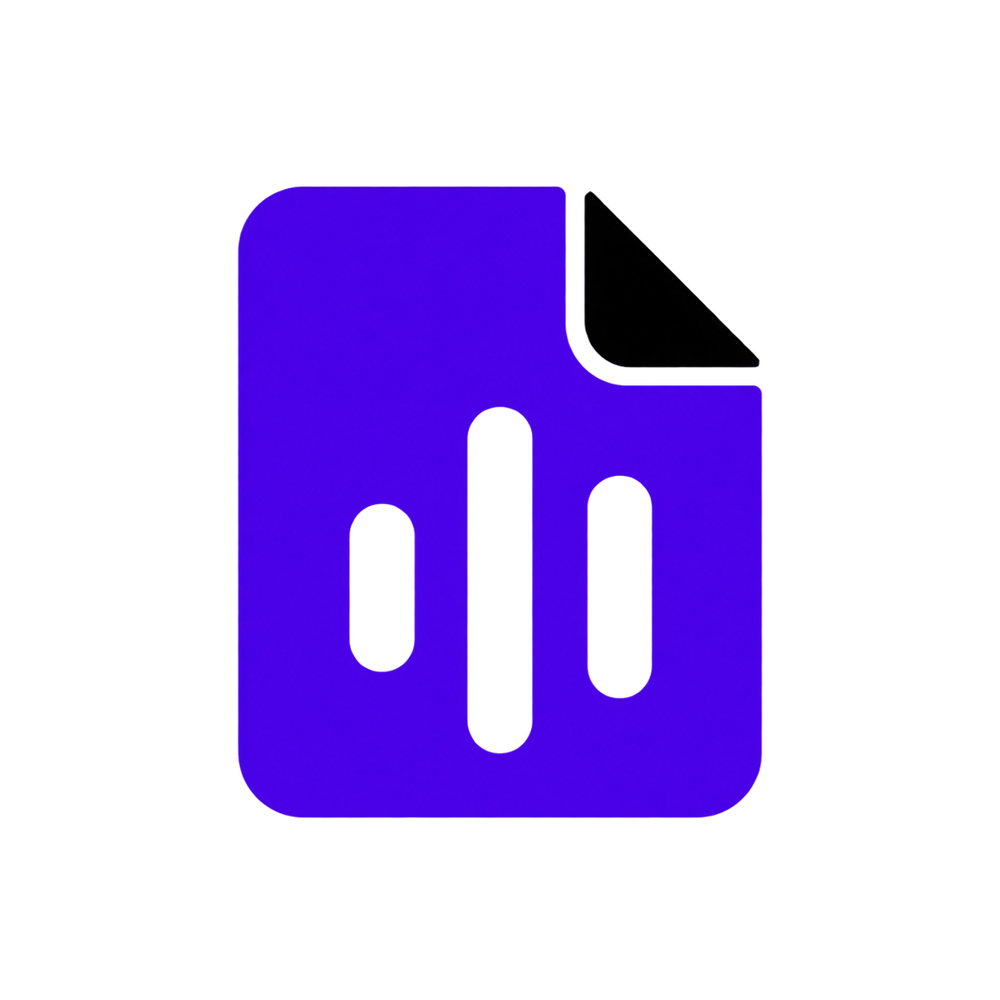
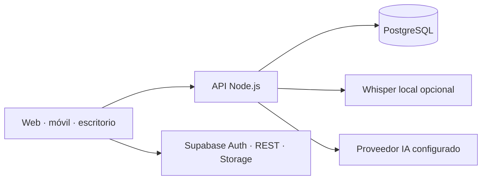

<div align="center">
  
  <h1>Lumenote</h1>
  <p><strong>De una clase grabada a una idea que sí recuerdas.</strong></p>
  <p>Captura lo importante. Compréndelo mejor. Estúdialo a tu manera.</p>
  <p>
    <a href="README.en.md">English</a> ·
    <a href="https://github.com/ToshioDev/lumenote-app">Ver el proyecto</a> ·
    <a href="https://github.com/ToshioDev/lumenote-app/issues">Proponer una idea</a>
  </p>
  <p>
    
    
    
    <a href="https://github.com/ToshioDev/lumenote-app/actions/workflows/utf8.yml"></a>
  </p>
</div>

<p align="center">
  
</p>

## El conocimiento no debería perderse cuando termina la clase

Lumenote convierte grabaciones, documentos, imágenes y apuntes en un espacio de estudio organizado por temas. En vez de volver a escuchar una hora para encontrar una idea, puedes regresar al momento exacto, leer un resumen enfocado y practicar lo que aprendiste.

**Captura una vez; vuelve a lo importante cuando lo necesites.**

| Captura | Comprende | Recuerda |
| --- | --- | --- |
| Guarda audio, documentos, imágenes, enlaces y texto dentro de temas. | Revisa transcripciones con marcas de tiempo, resúmenes y conversación contextual. | Convierte tus notas en tarjetas y preguntas para comprobar lo que entendiste. |

## Un flujo pensado para aprender, no para archivar

- **Todo junto por tema:** reúne clases y materiales con nombres que tengan sentido para ti.
- **Audio que puedes volver a consultar:** conserva la grabación y navega la transcripción por tiempo.
- **Apuntes útiles:** extrae ideas principales y puntos de acción sin perder el contexto de la nota.
- **IA sobre tu material:** conversa con el contenido conectado a tu backend y proveedor configurado.
- **Estudio activo:** practica con tarjetas y cuestionarios vinculados a tus temas.
- **Tu espacio, tu estilo:** usa la app en varias plataformas y personaliza su apariencia.

Las funciones de IA dependen de la configuración del despliegue. La transcripción local con Whisper puede ejecutarse en el stack Docker; los proveedores externos requieren sus propias credenciales y condiciones de servicio.

## Pruébalo en tu propio entorno

La forma más rápida de levantar la versión web, la API, PostgreSQL y el transcriptor local es Docker Compose. Necesitarás Docker Compose v2 y un proyecto Supabase propio para Auth, PostgREST y Storage. Supabase no se incluye dentro del Compose.

```powershell
Copy-Item .env.example .env
Copy-Item backend/.env.example backend/.env
```

Completa los valores de Supabase y define una contraseña PostgreSQL fuerte y única en `.env`. Configura `backend/.env` con los proveedores y credenciales que decidas utilizar. No compartas esos archivos ni pongas secretos en el cliente Flutter.

```powershell
docker compose up --build
```

Abre la app en `http://localhost:8765`; la API queda en `http://localhost:8787`. El primer inicio de Whisper puede descargar un modelo y tardar varios minutos. Antes de usar la app, revisa y aplica a tu propio proyecto las migraciones de [`supabase/migrations/`](supabase/migrations/).

Para compilar Flutter directamente, instala el SDK y configura tus valores de cliente:

```powershell
flutter pub get
flutter run -d chrome `
  --dart-define=SUPABASE_URL=https://TU_PROYECTO.supabase.co `
  --dart-define=SUPABASE_ANON_KEY=TU_CLAVE_PUBLICABLE `
  --dart-define=LUMENOTE_AI_URL=http://localhost:8787
```

En despliegues remotos, `LUMENOTE_AI_URL` debe ser una URL HTTPS accesible desde el navegador o dispositivo. La clave publicable de Supabase solo es segura junto con políticas RLS bien configuradas. La service-role, los tokens Codex y las claves de proveedores pertenecen exclusivamente al backend.

## Arquitectura



El repo incluye clientes Flutter para Android, iOS, web, Windows, macOS y Linux; una API Node.js; PostgreSQL para datos del backend; y un contenedor opcional de Whisper. Auth, REST y Storage de Supabase se configuran aparte. Consulta [modos de despliegue](docs/deployment-modes.md) antes de decidir dónde alojarlo.

## Construyámoslo mejor, en comunidad

Lumenote está en desarrollo activo. Puedes probarlo con tu propio backend, reportar lo que no fluye, proponer una función o ayudar a mejorar accesibilidad, transcripción en español, experiencia móvil, documentación y despliegue.

1. Abre un [issue](https://github.com/ToshioDev/lumenote-app/issues) para conversar una idea o reportar un problema.
2. Explora la estructura del proyecto y elige una mejora pequeña y comprobable.
3. Antes de enviar cambios, ejecuta las verificaciones relevantes:

```powershell
flutter analyze
flutter test
node --check backend/server.mjs
node --check backend/codex_runtime.mjs
python scripts/check_utf8.py
```

Las membresías, el checkout, los webhooks de pago y el panel de distribución siguen en distintas etapas; no se presentan como servicios comerciales listos para cobrar. El estado y las limitaciones actuales están en [`docs/membership-commerce-plan.md`](docs/membership-commerce-plan.md) y [`docs/distribution-control-plane.md`](docs/distribution-control-plane.md).

## Antes de reutilizar

Este repositorio todavía no incluye un archivo `LICENSE`; que el código sea visible públicamente no concede permiso para reutilizarlo o redistribuirlo. La ilustración y el branding de Kuromi son propiedad intelectual de terceros y tampoco se ofrecen bajo licencia de este proyecto. Si quieres reutilizar o redistribuir Lumenote, espera a que se publique una licencia explícita y verifica por separado los derechos de cada asset.

Las contribuciones son bienvenidas: compartir mejoras pequeñas también puede hacer que la próxima clase sea más fácil de recordar.
